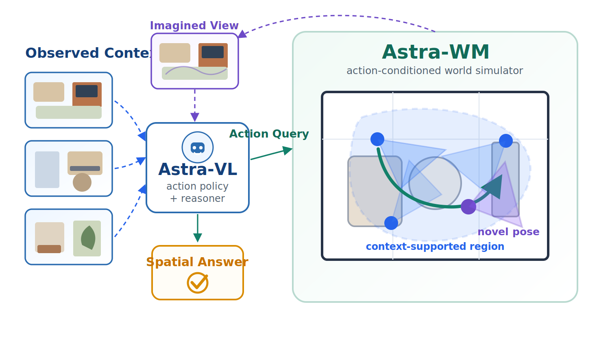
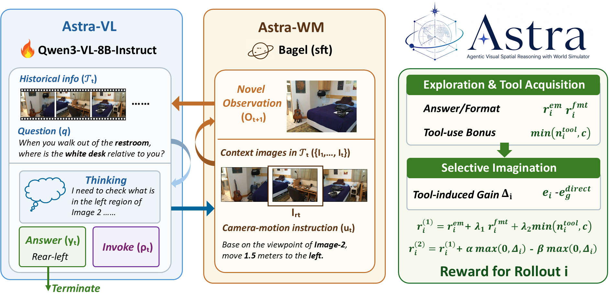
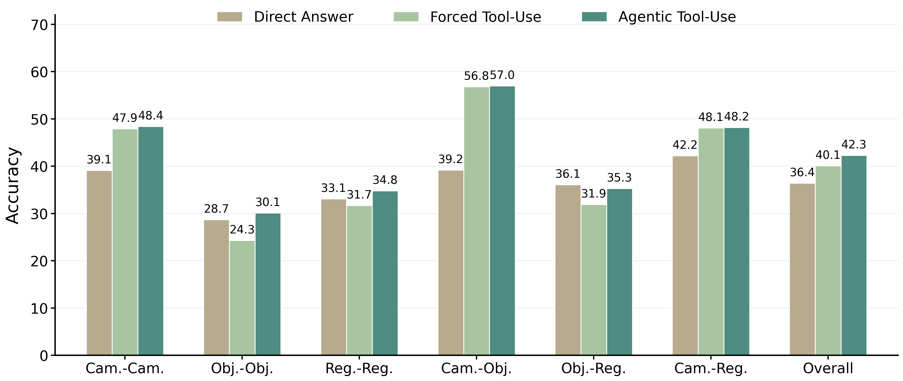

# Thinking with Imagination: Agentic Visual Spatial Reasoning with World Simulators

[](https://zcmax.github.io/projects/Thinking-With-Imagination)
[](https://arxiv.org/abs/2606.06476)
[](https://arxiv.org/pdf/2606.06476)

This is the official project repository for
[Thinking with Imagination: Agentic Visual Spatial Reasoning with World Simulators](https://arxiv.org/abs/2606.06476).



## 🧠 Introduction

**TL;DR**: We study visual spatial reasoning as active visual evidence acquisition. Astra lets a VLM decide when to query an action-conditioned world simulator, inspect the imagined view, and ground the final answer in both observed and simulated visual evidence.

Spatial reasoning from limited egocentric observations often requires evidence that is not directly visible. Conventional text-oriented chain-of-thought over fixed images provides limited gains in such settings. Astra reframes this problem as *thinking with imagination*: a policy can request a missing viewpoint from a learned world simulator and use the returned observation as spatial evidence.

The framework contains two main components:

- **Astra-VL**: an agentic VLM policy and reasoner that decides when to imagine, plans camera-motion queries, and grounds the returned visual evidence before answering.
- **Astra-WM**: an action-conditioned world simulator that synthesizes in-context novel observations from context images and natural-language camera-motion instructions.

## 🧩 Astra Method Overview

Astra couples an agentic VLM policy with an action-conditioned world simulator, then trains the policy to acquire tools and use imagined observations selectively.



## 🔍 Findings

1. **Spatial consistency matters.** Plausible generation is not enough: only an action-faithful world simulator turns imagined views into reliable spatial evidence and reasoning gains.
2. **Simulator use must be learned.** Strong proprietary VLMs can benefit from Astra-WM directly, while open-source VLMs need agentic training to decide when and how to imagine.
3. **Selective imagination beats tool overuse.** Rewarding tool calls alone leads to excessive simulator use, while the two-phase curriculum learns when imagined evidence is actually helpful.
4. **Imagination helps when evidence is viewpoint-dependent.** Agentic tool use keeps camera-centric gains while avoiding generated views when the original context is already sufficient.

## 🏆 Experimental Results on Spatial Reasoning Benchmarks

We compare **Direct Answer**, **Forced Tool-Use**, and **Agentic Tool-Use** settings. Values in parentheses denote absolute changes over the corresponding Direct Answer result of the same model.

<table>
  <thead>
    <tr>
      <th rowspan="2">Type</th>
      <th rowspan="2">Model</th>
      <th colspan="5">MMSI-Bench</th>
      <th colspan="4">MindCube-Tiny</th>
    </tr>
    <tr>
      <th>PR.</th>
      <th>Attr.</th>
      <th>Mot.</th>
      <th>MSR</th>
      <th>All</th>
      <th>Rot.</th>
      <th>Ard.</th>
      <th>Amg.</th>
      <th>All</th>
    </tr>
  </thead>
  <tbody>
    <tr><td colspan="11"><strong>Direct Answer</strong></td></tr>
    <tr>
      <td rowspan="3">Open-source</td>
      <td>Qwen3-VL-8B-Instruct</td>
      <td>30.8</td><td>30.1</td><td>27.7</td><td>28.1</td><td>29.8</td>
      <td>53.6</td><td>38.0</td><td>31.1</td><td>36.8</td>
    </tr>
    <tr>
      <td>Qwen3-VL-30B-Instruct</td>
      <td>31.2</td><td>35.8</td><td>25.9</td><td>29.1</td><td>30.6</td>
      <td>39.9</td><td>47.5</td><td>38.5</td><td>41.8</td>
    </tr>
    <tr>
      <td>Bagel-7B-MoT</td>
      <td>33.5</td><td>27.7</td><td>25.3</td><td>30.8</td><td>31.0</td>
      <td>34.5</td><td>31.4</td><td>42.8</td><td>34.7</td>
    </tr>
    <tr>
      <td rowspan="4">Proprietary</td>
      <td>GLM-4.5V</td>
      <td>35.6</td><td>36.9</td><td>29.3</td><td>30.3</td><td>33.8</td>
      <td>60.0</td><td>25.5</td><td>42.2</td><td>39.6</td>
    </tr>
    <tr>
      <td>GPT-4o</td>
      <td>28.0</td><td>32.3</td><td>36.0</td><td>30.8</td><td>30.3</td>
      <td>33.5</td><td>35.0</td><td>37.2</td><td>35.8</td>
    </tr>
    <tr>
      <td>Gemini-2.5-Pro</td>
      <td>39.0</td><td>36.2</td><td>33.3</td><td>34.3</td><td>36.9</td>
      <td>89.5</td><td>54.5</td><td>48.8</td><td>57.5</td>
    </tr>
    <tr>
      <td>Gemini-3-Flash</td>
      <td>45.6</td><td>45.4</td><td>44.0</td><td>46.0</td><td>45.4</td>
      <td>93.0</td><td>72.0</td><td>61.7</td><td>70.5</td>
    </tr>
    <tr><td colspan="11"><strong>Forced Tool-Use (zero-shot)</strong></td></tr>
    <tr>
      <td rowspan="3">Open-source</td>
      <td>Qwen3-VL-8B-Instruct</td>
      <td>30.4 (-0.4)</td><td>29.5 (-0.6)</td><td>19.6 (-8.1)</td><td>30.8 (+2.7)</td><td>28.6 (-1.2)</td>
      <td>31.1 (-22.5)</td><td>23.7 (-14.3)</td><td>26.8 (-4.3)</td><td>27.6 (-9.2)</td>
    </tr>
    <tr>
      <td>Qwen3-VL-30B-Instruct</td>
      <td>31.5 (+0.3)</td><td>28.7 (-7.1)</td><td>21.6 (-4.3)</td><td>28.1 (-1.0)</td><td>28.9 (-1.7)</td>
      <td>34.7 (-5.2)</td><td>32.7 (-14.8)</td><td>38.1 (-0.4)</td><td>35.7 (-6.1)</td>
    </tr>
    <tr>
      <td>Bagel-7B-MoT</td>
      <td>31.3 (-2.2)</td><td>25.6 (-2.1)</td><td>24.7 (-0.6)</td><td>28.7 (-2.1)</td><td>29.7 (-1.3)</td>
      <td>33.9 (-0.6)</td><td>26.8 (-4.6)</td><td>31.8 (-11.0)</td><td>29.2 (-5.5)</td>
    </tr>
    <tr>
      <td>Proprietary</td>
      <td>Gemini-3-Flash</td>
      <td>50.4 (+4.8)</td><td>51.5 (+6.1)</td><td>43.4 (-0.6)</td><td>50.3 (+4.3)</td><td>49.5 (+4.1)</td>
      <td>93.0 (+0.0)</td><td>70.3 (-1.7)</td><td>65.0 (+3.3)</td><td>72.7 (+2.2)</td>
    </tr>
    <tr><td colspan="11"><strong>Agentic Tool-Use</strong></td></tr>
    <tr>
      <td>Open-source</td>
      <td><strong>Astra (Qwen3-VL-8B-Instruct)</strong></td>
      <td><strong>42.3 (+11.5)</strong></td><td><strong>41.0 (+10.9)</strong></td><td><strong>32.1 (+4.4)</strong></td><td><strong>33.6 (+5.5)</strong></td><td><strong>38.8 (+9.0)</strong></td>
      <td><strong>60.1 (+6.5)</strong></td><td><strong>43.5 (+5.5)</strong></td><td><strong>36.8 (+5.7)</strong></td><td><strong>42.7 (+5.9)</strong></td>
    </tr>
  </tbody>
</table>

## 📊 Workflow Mode Ablation

The same trained Astra policy is evaluated under no-tool/direct-answer, forced-tool, and agentic-tool modes. Agentic tool use preserves the gains on camera-centric relations while avoiding unnecessary simulator calls when the original context is more reliable.



## 🚀 Release Progress

- [ ] Astra-VL and Astra-WM evaluation scripts
- [ ] Astra-WM checkpoints
- [ ] Astra-VL checkpoints
- [ ] Astra training code

## 📜 Citation

If you find this project useful, please cite:

```bibtex
@misc{zhu2026thinkingimaginationagenticvisual,
      title={Thinking with Imagination: Agentic Visual Spatial Reasoning with World Simulators}, 
      author={Chenming Zhu and Jingli Lin and Yilin Long and Peizhou Cao and Tai Wang and Jiangmiao Pang and Xihui Liu},
      year={2026},
      eprint={2606.06476},
      archivePrefix={arXiv},
      primaryClass={cs.CV},
      url={https://arxiv.org/abs/2606.06476}, 
}
```

## 🤝 Contact

If you have any questions, please contact chaimzhu@connect.hku.hk.

## 💡 Acknowledgement

We sincerely appreciate the following projects for their valuable codebase and benchmark: [Verl](https://github.com/volcengine/verl), [vllm-omni](https://github.com/vllm-project/vllm-omni), [SenseNova-MARS](https://github.com/OpenSenseNova/SenseNova-MARS), [MMSI-Bench](https://github.com/OpenRobotLab/MMSI-Bench), [MindCube](https://github.com/mll-lab-nu/MindCube).
